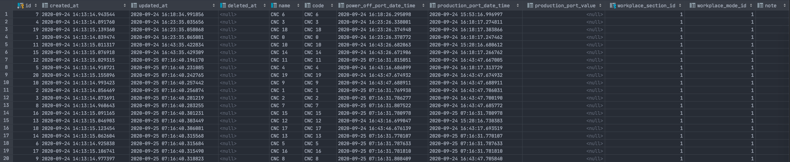
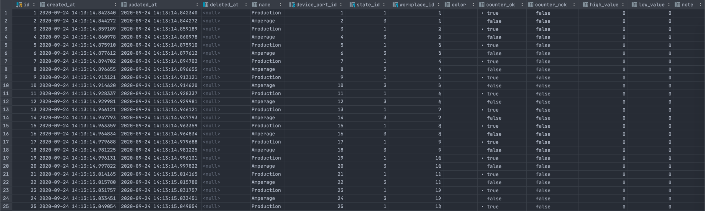

[](https://www.jetbrains.com/go/)
<br/>

[](https://github.com/petrjahoda/state_service/commits/master)
[](https://github.com/petrjahoda/state_service/issues)
<br/>


<br/>
[](https://hub.docker.com/r/petrjahoda/state_service)
[](https://hub.docker.com/r/petrjahoda/state_service/tags)
<br/>
[](https://www.postgresql.org) [](https://www.docker.com)

# State Service

## Description
Go service that creates data for workplaces (based on digital and analog records) and inserts them into ```state_records``` table

## Installation Information
Install under docker runtime using [this dockerfile image](https://github.com/petrjahoda/system/tree/master/latest) with this command: ```docker-compose up -d```

## Implementation Information
Check the software running with this command: ```docker stats```. <br/>
State_service has to be running.

### Setup workplace for processing
1. Add workplace to database: insert new data into ```workplaces``` table
    - insert workplace name into ```name``` column
    - insert 1 into ```workplace_section_id``` column
    - insert 1 into ```workplace_mode_id``` column
2. Asign device_ports to workplace in ```workplace_ports``` table
    - insert workplace port name into ```name``` column
    - assign proper device_port_id into ```device_port_id``` column
    - assign proper state_id into ```state_id``` column
        - state_id with value 1 has to be assigned to device_port_type.name ```Digital```
        - state_id with value 2 has to be assigned to device_port_type.name ```Analog```
    - assign proper workplace_id into ```workplace_id``` column
    - assign true for port you want to calculates OK pcs into ```counter_ok``` column
        - this port should be of type device_port_type.name ```Digital```
    - assign true for port you want to calculates NOK pcs into ```counter_nok``` column
        - this port should be of type device_port_type.name ```Digital```
    
© 2020 Petr Jahoda


Workplaces example


Workplace ports example
